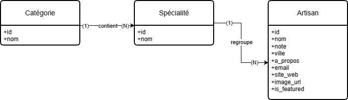
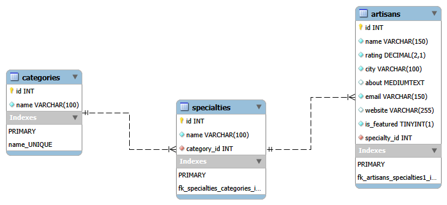

# Rapport de projet 

## Introduction

Dans le cadre de ma formation de développeur web, j’ai réalisé un projet intitulé *Trouve ton artisan*.  
Ce projet a pour objectif de reproduire un contexte professionnel réel, en suivant l’ensemble des étapes de conception et de développement d’une application web.

Les sections suivantes détaillent l’analyse du besoin, les choix effectués et la méthodologie de travail adoptée.

---

## 1. Analyse du contexte du projet

### 1.1 Présentation du commanditaire

Le projet est initié par la **Région Auvergne Rhône-Alpes**, qui souhaite mettre en valeur les artisans locaux et faciliter leur mise en relation avec les habitants.

### 1.2 Objectifs du projet

Les objectifs principaux identifiés sont :
- améliorer la **visibilité des artisans locaux**
- permettre aux habitants de **trouver facilement un artisan**
- proposer une plateforme simple et accessible

### 1.3 Public cible

Le site s’adresse au **grand public**, incluant :
- des utilisateurs de tous âges
- des personnes peu familières avec le numérique

### 1.4 Contraintes générales

Plusieurs contraintes sont imposées par le cahier des charges :
- site **responsive** (mobile, tablette, desktop)
- respect des règles d’**accessibilité**
- validation du **design avant le développement**

### 1.5 Analyse et déductions

À partir de ces éléments, le site doit être :
- simple à utiliser
- rapide à comprendre
- lisible sur mobile
- centré sur l’expérience utilisateur plutôt que sur des aspects techniques

> **Synthèse** :  
> Le projet consiste à développer une plateforme web permettant aux habitants de trouver facilement un artisan local à partir de critères simples tels que la catégorie ou le nom.

---

## 2. Analyse des utilisateurs (UX)

### 2.1 Profil des utilisateurs

Les utilisateurs principaux sont :
- des habitants de la région
- des profils variés, parfois peu à l’aise avec les outils numériques

### 2.2 Impacts sur la conception

Ces profils impliquent les choix suivants :
- navigation claire et structurée
- limitation du nombre de clics
- textes simples et explicites
- utilisation d’éléments visuels (icônes, étapes numérotées)

> L’interface doit être intuitive et accessible à un public large, y compris des utilisateurs peu familiers avec les outils numériques.

---

## 3. Analyse fonctionnelle

### 3.1 Fonctionnalités principales

Les fonctionnalités essentielles identifiées sont :
- affichage des catégories d’artisans
- recherche d’un artisan par nom
- consultation d’une fiche artisan détaillée
- mise en avant de trois artisans du mois
- formulaire de contact
- navigation responsive
- page d’erreur 404

### 3.2 Périmètre volontairement limité

Certaines fonctionnalités ont été volontairement exclues :
- création de compte utilisateur
- système de paiement
- interface d’administration

> Le périmètre fonctionnel a volontairement été limité afin de répondre strictement aux besoins exprimés, sans complexifier l’application inutilement.

---

## 4. Contraintes techniques

### 4.1 Contraintes imposées par la formation

Les technologies imposées sont :
- React
- Express
- MySQL
- API REST
- Figma
- Git / GitHub

### 4.2 Contraintes liées au projet

Le projet doit également respecter :
- le responsive design
- les règles d’accessibilité (WCAG)
- des principes de sécurité
- des bonnes pratiques SEO
- l’utilisation exclusive des données issues de la base de données

> Les choix techniques ont été guidés par les contraintes pédagogiques du projet ainsi que par les bonnes pratiques du développement web moderne.

---

## 5. Organisation du travail

Le projet a été organisé selon une méthodologie progressive, inspirée des pratiques professionnelles du développement web.  
Chaque étape dépend de la précédente afin de limiter les retours en arrière et d’assurer une cohérence globale entre le design, les données et le développement.

### 5.1 Ordre des travaux réalisés

Le projet a été réalisé en suivant une démarche progressive inspirée des méthodes de développement web professionnelles :

1. Analyse du besoin et lecture du cahier des charges
2. Initialisation du projet et mise en place du versionning (Git / GitHub)
3. Conception des maquettes et du prototype interactif sous Figma (approche mobile-first)
4. Modélisation de la base de données (MCD / MLD)
5. Création de la base de données MySQL et insertion du jeu d’essai
6. Développement de l’API REST (Node.js, Express, Sequelize)
7. Développement du front-end avec React
8. Vérification des aspects accessibilité, sécurité et référencement (SEO)
9. Tests, déploiement et rédaction du dossier final

>Cette organisation a permis de séparer clairement les phases de conception, de développement backend, puis de développement frontend, tout en conservant une cohérence globale du projet.

### 5.2 Gestion du versionning

Le versionning du projet a été assuré à l’aide de Git et GitHub.  
Chaque fonctionnalité a été découpée sous forme d’issues. Une branche dédiée a été créée pour chaque issue, avant d’être fusionnée dans la branche principale via une pull request une fois la fonctionnalité validée.

Cette organisation permet de :
- structurer le travail
- faciliter la compréhension de l’historique
- se rapprocher des méthodes utilisées en entreprise

---

## 6. Conception de l’interface (Figma)

La conception de l’interface utilisateur a été réalisée à l’aide de l’outil Figma.  
Cette étape a permis de définir la structure des pages, le parcours utilisateur et l’organisation des contenus avant toute phase de développement.

### 6.1 Organisation du fichier Figma

Un fichier Figma dédié au projet a été créé et organisé en plusieurs pages afin de structurer le travail :

- une page dédiée au style guide
- une page pour les wireframes
- une page pour les maquettes finales

>Cette organisation permet de séparer les différentes phases de conception et de faciliter la lisibilité du projet.

### 6.2 Approche mobile-first

La conception des maquettes a débuté par le format mobile, conformément aux bonnes pratiques du développement web et aux contraintes du projet.  
Le format mobile a été choisi comme base de réflexion afin de se concentrer sur l’essentiel des contenus et sur l’expérience utilisateur.

L’ensemble des pages principales a d’abord été pensé et structuré pour un affichage mobile avant d’être décliné pour les formats tablette et desktop.

### 6.3 Réalisation des wireframes

Dans un premier temps, des wireframes ont été réalisés pour l’ensemble des pages du site.  
Les wireframes ont été conçus en niveaux de gris, sans choix graphiques définitifs, afin de se concentrer uniquement sur la structure, la hiérarchie des informations et la navigation.

Les pages suivantes ont été réalisées en wireframe mobile :
- page d’accueil
- page de liste des artisans
- page de fiche artisan
- page d’erreur 404

### 6.4 Structuration des pages et blocs fonctionnels

Chaque page a été découpée en blocs fonctionnels distincts (header, contenu principal, footer).  
Les éléments ont été regroupés de manière logique afin de faciliter la compréhension et la navigation pour l’utilisateur.

Une attention particulière a été portée à :
- la clarté des informations
- la hiérarchisation des contenus
- la lisibilité sur écran mobile
- la gestion du défilement vertical (scroll)

### 6.5 Prise en compte de l’expérience utilisateur

Lors de la conception des wireframes, l’expérience utilisateur a été placée au centre de la réflexion.  
Des éléments tels que la barre de recherche, les messages d’erreur (aucun résultat, page 404) ou les boutons de retour ont été intégrés afin d’éviter toute situation de blocage pour l’utilisateur.

>Cette étape a permis de valider les parcours principaux avant de passer à la phase de design graphique et de développement.

### 6.6 Création du style guide et du design system

Après validation des wireframes, une étape de création du style guide a été réalisée.
Cette étape a permis de définir une base graphique cohérente avant la réalisation des maquettes finales.

Le style guide regroupe :
- la typographie utilisée (Graphik)
- la palette de couleurs issue du brief et du site institutionnel de référence
- les styles de titres et de textes (H1, H2, Body, Label)
- les composants principaux (boutons, champs de formulaire, cartes artisan)
- les états des composants (normal, hover, focus, désactivé)

Les éléments ont été enregistrés sous forme de composants réutilisables afin de garantir une cohérence graphique sur l’ensemble des pages.

>Cette approche correspond à la mise en place d’un design system, pratique courante en environnement professionnel.

### 6.7 Mise en place d’une grille de mise en page responsive

Une grille de mise en page a été utilisée pour structurer l’ensemble des écrans :
- 12 colonnes pour le format desktop
- 8 colonnes pour le format tablette
- 4 colonnes pour le format mobile

L’utilisation de cette grille a permis d’aligner précisément les éléments et d’assurer une cohérence visuelle entre les différents formats d’écran.

>Cette étape a été déterminante pour obtenir un rendu professionnel et faciliter l’adaptation responsive des maquettes.

### 6.8 Réalisation des maquettes UI (design graphique)

Une fois le style guide défini, les wireframes ont été transformés en maquettes graphiques complètes.

Chaque écran a été conçu en respectant :
- la hiérarchie visuelle définie dans les wireframes
- la grille de mise en page
- les composants du style guide
- les principes d’accessibilité et de lisibilité

Les maquettes ont été réalisées pour les trois formats :
- Desktop
- Tablette
- Mobile

>L’adaptation entre les formats ne s’est pas limitée à un simple redimensionnement.
>La disposition des éléments a été repensée pour chaque écran afin de conserver une expérience utilisateur optimale (nombre de colonnes, empilement vertical, gestion de l’espace).

### 6.9 Adaptation des interfaces selon les formats (responsive thinking)

Le passage du desktop à la tablette puis au mobile a nécessité une adaptation réfléchie :
- affichage du menu complet sur desktop
- réorganisation du header sur tablette pour améliorer la lisibilité
- utilisation d’un menu burger en mobile

Sur mobile, un menu en overlay a été prototypé afin de simuler un comportement réel d’application mobile, permettant d’accéder aux différentes catégories et aux pages légales.

>Cette adaptation montre une réflexion centrée sur l’ergonomie et les usages réels des utilisateurs selon le support.

### 6.10 Mise en place du prototype interactif

Un prototype fonctionnel a ensuite été réalisé directement sur les maquettes finales.

Le prototype permet de simuler l’ensemble des parcours utilisateurs :
- navigation depuis la page d’accueil
- recherche et navigation par catégorie
- consultation d’une fiche artisan
- accès aux pages légales
- gestion d’une page d’erreur 404
- retour à l’accueil depuis toutes les pages

Les comportements de défilement vertical ont été configurés afin de reproduire une navigation réaliste.

Sur mobile, l’ouverture du menu burger a été simulée à l’aide d’un système d’overlay, reproduisant le comportement attendu d’une interface mobile.

>Ce prototype permet de tester l’expérience utilisateur avant toute phase de développement.

### 6.11 Apports de l’étape Figma dans le projet

La phase de conception sur Figma a permis :
- de valider l’architecture des pages avant le développement
- d’anticiper les problématiques responsive
- de structurer un design system réutilisable en développement
- de clarifier les parcours utilisateurs
- de limiter les erreurs et retours en arrière lors de la phase de développement

>Cette étape a joué un rôle essentiel dans la réussite du projet en servant de référence visuelle et fonctionnelle pour la suite du développement.

---

## 7. Modélisation de la base de données (MCD / MLD)

### 7.1 Règles de gestion

D’après le cahier des charges :
- Un artisan appartient à une seule spécialité.
- Une spécialité appartient à une seule catégorie.
- Une catégorie peut contenir plusieurs spécialités.
- Une spécialité peut contenir plusieurs artisans.

>Ces règles ont conduit à la création de trois entités principales :
Catégorie, Spécialité et Artisan.

---

### 7.2 MCD (Modèle Conceptuel de Données)
Un champ image_url nullable a été ajouté afin de supporter l’affichage d’une image d’artisan dans les cartes et la page détail (présent dans les maquettes Figma). En l’absence de données fournies, une image générique sera utilisée côté interface.

Entités :

Catégorie
- id
- nom

Spécialité
- id
- nom

Artisan
- id
- nom
- note
- ville
- a_propos
- email
- site_web
- image
- is_featured

Relations :

Catégorie (1) ─── (N) Spécialité  
Spécialité (1) ─── (N) Artisan

**diagramme conceptuel**


---

### 7.3 MLD (Modèle Logique de Données)

categories
- id (PK)
- name

specialties
- id (PK)
- name
- category_id (FK)

artisans
- id (PK)
- name
- rating
- city
- about
- email
- website
- image_url
- is_featured
- specialty_id (FK)

Les clés primaires (id) sont définies en auto-incrément afin de garantir l’unicité des enregistrements dans chaque table.

Les relations entre entités sont assurées par des **clés étrangères** :
- specialties.category_id → categories.id
- artisans.specialty_id → specialties.id

Ces contraintes relationnelles permettent d’assurer l’intégrité des données et d’empêcher la création d’enregistrements incohérents (par exemple un artisan sans spécialité).

**Diagramme EER**



---

### 7.4 Justification

La séparation des entités Catégorie, Spécialité et Artisan permet de respecter les règles métier définies dans le cahier des charges et d’éviter la duplication de données.

Cette structure relationnelle facilite également les requêtes nécessaires à l’application :
- affichage des catégories dans le menu,
- filtrage des artisans par catégorie,
- affichage de la spécialité d’un artisan,
- gestion des artisans du mois.

La structure de la base respecte une normalisation simple (3NF) :

- les catégories sont stockées une seule fois.
- les spécialités sont liées à une catégorie.
- les artisans référencent une spécialité.

Cette organisation évite la redondance de données et simplifie les mises à jour.

---

## 8. Développement de l’API – à compléter

---

## 9. Développement front-end – à compléter

---

## 10. Difficultés rencontrées et solutions – à compléter

### 10.1 Conflit de collation MySQL lors des requêtes de recherche

Lors de l’exécution des requêtes de tests SQL, une erreur MySQL est apparue :
```
#1267 - Illegal mix of collations for operation 'like'
```

Cette erreur survenait lors de l’utilisation de l’opérateur LIKE sur des champs texte de la base de données.

Après analyse, le problème provenait d’un **mélange de collations** entre :

- la base de données
- certaines tables
- la session MySQL.

Certaines parties du schéma utilisaient :
```
utf8mb4_general_ci
```
alors que d’autres utilisaient :
```
utf8mb4_unicode_ci
```
MySQL refusant de comparer des chaînes de caractères utilisant des collations différentes, les requêtes de recherche échouaient.

#### Solution mise en place

La base de données a été **standardisée** afin d’utiliser une configuration unique :
```
CHARACTER SET utf8mb4
COLLATE utf8mb4_unicode_ci
```

Cette standardisation a été appliquée :

- à la base de données
- aux tables
- aux scripts SQL de création (00_create_database.sql et 02_schema.sql).

Après cette correction, les requêtes utilisant LIKE fonctionnent normalement.

#### Justification technique

Le charset utf8mb4 permet de supporter l’ensemble des caractères Unicode modernes (accents, caractères internationaux, emojis) et constitue aujourd’hui le standard pour les applications web.

La collation utf8mb4_unicode_ci définit les règles de comparaison et de tri des chaînes de caractères selon les standards Unicode. Elle permet notamment :

- une gestion correcte des accents
- une comparaison insensible à la casse,
- un tri alphabétique cohérent.

Cette configuration est couramment utilisée dans les applications professionnelles (SaaS, e-commerce, systèmes métiers, applications bancaires) afin d’assurer la cohérence linguistique et la stabilité des requêtes SQL.

#### Bonnes pratiques retenues

Cette difficulté a permis de mettre en évidence l’importance de :

- définir une collation cohérente dès la création de la base
- éviter les mélanges de collations dans un projet,
- standardiser le charset et la collation au niveau de la base et des tables
- privilégier utf8mb4_unicode_ci pour les applications web modernes.

Cette correction garantit désormais un comportement homogène de la base de données et évite les erreurs de type :
```
Illegal mix of collations for operation 'like'
```

---

## 11. Compétences acquises – à compléter

---
