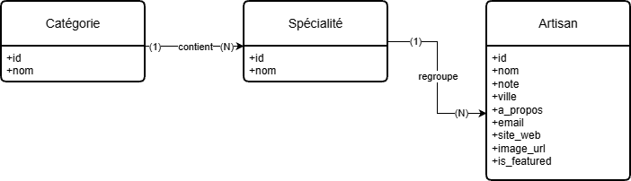
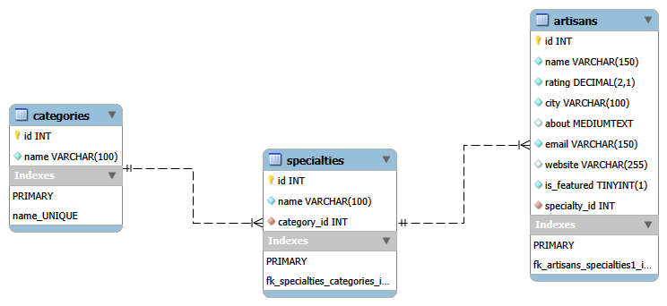

# Rapport de projet 

## Introduction

Dans le cadre de ma formation de développeur web, j’ai réalisé un projet intitulé *Trouve ton artisan*.  
Ce projet a pour objectif de reproduire un contexte professionnel réel, en suivant l’ensemble des étapes de conception et de développement d’une application web.

Les sections suivantes détaillent l’analyse du besoin, les choix effectués et la méthodologie de travail adoptée.

---

## 1. Analyse du contexte du projet

### 1.1 Présentation du commanditaire

Le projet est initié par la **Région Auvergne Rhône-Alpes**, qui souhaite mettre en valeur les artisans locaux et faciliter leur mise en relation avec les habitants.

### 1.2 Objectifs du projet

Les objectifs principaux identifiés sont :
- améliorer la **visibilité des artisans locaux**
- permettre aux habitants de **trouver facilement un artisan**
- proposer une plateforme simple et accessible

### 1.3 Public cible

Le site s’adresse au **grand public**, incluant :
- des utilisateurs de tous âges
- des personnes peu familières avec le numérique

### 1.4 Contraintes générales

Plusieurs contraintes sont imposées par le cahier des charges :
- site **responsive** (mobile, tablette, desktop)
- respect des règles d’**accessibilité**
- validation du **design avant le développement**

### 1.5 Analyse et déductions

À partir de ces éléments, le site doit être :
- simple à utiliser
- rapide à comprendre
- lisible sur mobile
- centré sur l’expérience utilisateur plutôt que sur des aspects techniques

> **Synthèse** :  
> Le projet consiste à développer une plateforme web permettant aux habitants de trouver facilement un artisan local à partir de critères simples tels que la catégorie ou le nom.

---

## 2. Analyse des utilisateurs (UX)

### 2.1 Profil des utilisateurs

Les utilisateurs principaux sont :
- des habitants de la région
- des profils variés, parfois peu à l’aise avec les outils numériques

### 2.2 Impacts sur la conception

Ces profils impliquent les choix suivants :
- navigation claire et structurée
- limitation du nombre de clics
- textes simples et explicites
- utilisation d’éléments visuels (icônes, étapes numérotées)

> L’interface doit être intuitive et accessible à un public large, y compris des utilisateurs peu familiers avec les outils numériques.

---

## 3. Analyse fonctionnelle

### 3.1 Fonctionnalités principales

Les fonctionnalités essentielles identifiées sont :
- affichage des catégories d’artisans
- recherche d’un artisan par nom
- consultation d’une fiche artisan détaillée
- mise en avant de trois artisans du mois
- formulaire de contact
- navigation responsive
- page d’erreur 404

---

## 4. Contraintes techniques

### 4.1 Contraintes imposées par la formation

Les technologies imposées sont :
- React
- Express
- MySQL
- Sequelize
- API REST
- Figma
- Git / GitHub

### 4.2 Contraintes liées au projet

Le projet doit également respecter :
- le responsive design
- les règles d’accessibilité (WCAG)
- des principes de sécurité
- des bonnes pratiques SEO
- l’utilisation exclusive des données issues de la base de données

> Les choix techniques ont été guidés par les contraintes pédagogiques du projet ainsi que par les bonnes pratiques du développement web moderne.

---

## 5. Organisation du travail

Le projet a été organisé selon une méthodologie en V. 
Chaque étape dépend de la précédente afin de limiter les retours en arrière et d’assurer une cohérence globale entre le design, les données et le développement.

### 5.1 Ordre des travaux réalisés

Le projet a été réalisé en suivant une démarche progressive inspirée des méthodes de développement web professionnelles :

1. Analyse du besoin et lecture du cahier des charges
2. Initialisation du projet et mise en place du versionning (Git / GitHub)
3. Conception des maquettes et du prototype interactif sous Figma (approche mobile-first)
4. Modélisation de la base de données (MCD / MLD)
5. Création de la base de données MySQL et insertion du jeu d’essai
6. Développement de l’API REST (Node.js, Express, MySQL)
7. Développement du front-end avec React
8. Vérification des aspects accessibilité, sécurité et référencement (SEO)
9. Tests, déploiement et rédaction du dossier final

>Cette organisation a permis de séparer clairement les phases de conception, de développement backend, puis de développement frontend, tout en conservant une cohérence globale du projet.

### 5.2 Gestion du versionning

Le versionning du projet a été assuré à l’aide de Git et GitHub.  
Chaque fonctionnalité a été découpée sous forme d’issues. Une branche dédiée a été créée pour chaque issue, avant d’être fusionnée dans la branche principale via une pull request une fois la fonctionnalité validée.

Cette organisation permet de :
- structurer le travail
- faciliter la compréhension de l’historique
- se rapprocher des méthodes utilisées en entreprise

---

## 6. Conception de l’interface (Figma)

La conception de l’interface utilisateur a été réalisée à l’aide de l’outil Figma.  
Cette étape a permis de définir la structure des pages, le parcours utilisateur et l’organisation des contenus avant toute phase de développement.

### 6.1 Organisation du fichier Figma

Un fichier Figma dédié au projet a été créé et organisé en plusieurs pages afin de structurer le travail :

- une page dédiée au style guide
- une page pour les wireframes
- une page pour les maquettes finales

>Cette organisation permet de séparer les différentes phases de conception et de faciliter la lisibilité du projet.

### 6.2 Approche mobile-first

La conception des maquettes a débuté par le format mobile, conformément aux bonnes pratiques du développement web et aux contraintes du projet.  
Le format mobile a été choisi comme base de réflexion afin de se concentrer sur l’essentiel des contenus et sur l’expérience utilisateur.

L’ensemble des pages principales a d’abord été pensé et structuré pour un affichage mobile avant d’être décliné pour les formats tablette et desktop.

### 6.3 Réalisation des wireframes

Dans un premier temps, des wireframes ont été réalisés pour l’ensemble des pages du site.  
Les wireframes ont été conçus en niveaux de gris, sans choix graphiques définitifs, afin de se concentrer uniquement sur la structure, la hiérarchie des informations et la navigation.

Les pages suivantes ont été réalisées en wireframe mobile :
- page d’accueil
- page de liste des artisans
- page de fiche artisan
- page d’erreur 404

### 6.4 Structuration des pages et blocs fonctionnels

Chaque page a été découpée en blocs fonctionnels distincts (header, contenu principal, footer).  
Les éléments ont été regroupés de manière logique afin de faciliter la compréhension et la navigation pour l’utilisateur.

Une attention particulière a été portée à :
- la clarté des informations
- la hiérarchisation des contenus
- la lisibilité sur écran mobile
- la gestion du défilement vertical (scroll)

### 6.5 Prise en compte de l’expérience utilisateur

Lors de la conception des wireframes, l’expérience utilisateur a été placée au centre de la réflexion.  
Des éléments tels que la barre de recherche, les messages d’erreur (aucun résultat, page 404) ou les boutons de retour ont été intégrés afin d’éviter toute situation de blocage pour l’utilisateur.

>Cette étape a permis de valider les parcours principaux avant de passer à la phase de design graphique et de développement.

### 6.6 Création du style guide et du design system

Après validation des wireframes, une étape de création du style guide a été réalisée.
Cette étape a permis de définir une base graphique cohérente avant la réalisation des maquettes finales.

Le style guide regroupe :
- la typographie utilisée (Graphik)
- la palette de couleurs issue du brief et du site institutionnel de référence
- les styles de titres et de textes (H1, H2, Body, Label)
- les composants principaux (boutons, champs de formulaire, cartes artisan)
- les états des composants (normal, hover, focus, désactivé)

Les éléments ont été enregistrés sous forme de composants réutilisables afin de garantir une cohérence graphique sur l’ensemble des pages.

>Cette approche correspond à la mise en place d’un design system, pratique courante en environnement professionnel.

### 6.7 Mise en place d’une grille de mise en page responsive

Une grille de mise en page a été utilisée pour structurer l’ensemble des écrans :
- 12 colonnes pour le format desktop
- 8 colonnes pour le format tablette
- 4 colonnes pour le format mobile

L’utilisation de cette grille a permis d’aligner précisément les éléments et d’assurer une cohérence visuelle entre les différents formats d’écran.

>Cette étape a été déterminante pour obtenir un rendu professionnel et faciliter l’adaptation responsive des maquettes.

### 6.8 Réalisation des maquettes UI (design graphique)

Une fois le style guide défini, les wireframes ont été transformés en maquettes graphiques complètes.

Chaque écran a été conçu en respectant :
- la hiérarchie visuelle définie dans les wireframes
- la grille de mise en page
- les composants du style guide
- les principes d’accessibilité et de lisibilité

Les maquettes ont été réalisées pour les trois formats :
- Desktop
- Tablette
- Mobile

>L’adaptation entre les formats ne s’est pas limitée à un simple redimensionnement.
>La disposition des éléments a été repensée pour chaque écran afin de conserver une expérience utilisateur optimale (nombre de colonnes, empilement vertical, gestion de l’espace).

### 6.9 Adaptation des interfaces selon les formats (responsive thinking)

Le passage du desktop à la tablette puis au mobile a nécessité une adaptation réfléchie :
- affichage du menu complet sur desktop
- réorganisation du header sur tablette pour améliorer la lisibilité
- utilisation d’un menu burger en mobile

Sur mobile, un menu en overlay a été prototypé afin de simuler un comportement réel d’application mobile, permettant d’accéder aux différentes catégories et aux pages légales.

>Cette adaptation montre une réflexion centrée sur l’ergonomie et les usages réels des utilisateurs selon le support.

### 6.10 Mise en place du prototype interactif

Un prototype fonctionnel a ensuite été réalisé directement sur les maquettes finales.

Le prototype permet de simuler l’ensemble des parcours utilisateurs :
- navigation depuis la page d’accueil
- recherche et navigation par catégorie
- consultation d’une fiche artisan
- accès aux pages légales
- gestion d’une page d’erreur 404
- retour à l’accueil depuis toutes les pages

Les comportements de défilement vertical ont été configurés afin de reproduire une navigation réaliste.

Sur mobile, l’ouverture du menu burger a été simulée à l’aide d’un système d’overlay, reproduisant le comportement attendu d’une interface mobile.

>Ce prototype permet de tester l’expérience utilisateur avant toute phase de développement.

### 6.11 Apports de l’étape Figma dans le projet

La phase de conception sur Figma a permis :
- de valider l’architecture des pages avant le développement
- d’anticiper les problématiques responsive
- de structurer un design system réutilisable en développement
- de clarifier les parcours utilisateurs
- de limiter les erreurs et retours en arrière lors de la phase de développement

>Cette étape a joué un rôle essentiel dans la réussite du projet en servant de référence visuelle et fonctionnelle pour la suite du développement.

---

## 7. Modélisation de la base de données (MCD / MLD)

### 7.1 Règles de gestion

D’après le cahier des charges :
- Un artisan appartient à une seule spécialité.
- Une spécialité appartient à une seule catégorie.
- Une catégorie peut contenir plusieurs spécialités.
- Une spécialité peut contenir plusieurs artisans.

>Ces règles ont conduit à la création de trois entités principales :
Catégorie, Spécialité et Artisan.

---

### 7.2 MCD (Modèle Conceptuel de Données)
Un champ image_url nullable a été ajouté afin de supporter l’affichage d’une image d’artisan dans les cartes et la page détail (présent dans les maquettes Figma). En l’absence de données fournies, une image générique sera utilisée côté interface.

Entités :

Catégorie
- id
- nom

Spécialité
- id
- nom

Artisan
- id
- nom
- note
- ville
- a_propos
- email
- site_web
- image
- is_featured

Relations :

Catégorie (1) ─── (N) Spécialité  
Spécialité (1) ─── (N) Artisan

**diagramme conceptuel**


---

### 7.3 MLD (Modèle Logique de Données)

categories
- id (PK)
- name

specialties
- id (PK)
- name
- category_id (FK)

artisans
- id (PK)
- name
- rating
- city
- about
- email
- website
- image_url
- is_featured
- specialty_id (FK)

Les clés primaires (id) sont définies en auto-incrément afin de garantir l’unicité des enregistrements dans chaque table.

Les relations entre entités sont assurées par des **clés étrangères** :
- specialties.category_id → categories.id
- artisans.specialty_id → specialties.id

Ces contraintes relationnelles permettent d’assurer l’intégrité des données et d’empêcher la création d’enregistrements incohérents (par exemple un artisan sans spécialité).

**Diagramme EER**



---

### 7.4 Justification

La séparation des entités Catégorie, Spécialité et Artisan permet de respecter les règles métier définies dans le cahier des charges et d’éviter la duplication de données.

Cette structure relationnelle facilite également les requêtes nécessaires à l’application :
- affichage des catégories dans le menu,
- filtrage des artisans par catégorie,
- affichage de la spécialité d’un artisan,
- gestion des artisans du mois.

La structure de la base respecte une normalisation simple (3NF) :

- les catégories sont stockées une seule fois.
- les spécialités sont liées à une catégorie.
- les artisans référencent une spécialité.

Cette organisation évite la redondance de données et simplifie les mises à jour.

---

## 8. Développement de l’API 
Une API REST a été développée afin de permettre au frontend React d’accéder aux données stockées dans la base MySQL.
Cette API a été réalisée avec **Node.js et Express**, en utilisant l’ORM **Sequelize** pour l’accès à la base de données MySQL.
Sequelize permet de manipuler les données via des **modèles JavaScript représentant les tables** plutôt que d’écrire directement des requêtes SQL dans les contrôleurs.

### 8.1 Architecture du backend

#### 📁 Architecture
```
backend/
├── src/
│   ├── app.js            # Configuration Express
│   ├── server.js         # Point d'entrée du serveur
│   │
│   ├── db/
│   │   └── sequelize.js  # Configuration Sequelize (connexion DB)
│   │
│   ├── models/           # Modèles Sequelize
│   │   ├── Artisan.js
│   │   ├── Category.js
│   │   ├── Specialty.js
│   │   └── index.js      # Associations entre modèles
│   │
│   ├── controllers/      # Logique métier
│   │   ├── artisans.controller.js
│   │   └── categories.controller.js
│   │
│   ├── routes/           # Définition des endpoints
│   │   ├── artisans.routes.js
│   │   └── categories.routes.js
│   │
│   ├── middlewares/      # Middlewares (validation, erreurs)
│   │   ├── catchAsync.js
│   │   ├── errorHandler.js
│   │   └── validateIdParam.js
│   │
│   └── docs/             # Documentation OpenAPI
│       └── openapi.js
│
└── package.json
```

---

L’API a été structurée selon une architecture modulaire inspirée des bonnes pratiques professionnelles :

- **routes** : définition des endpoints HTTP
- **controllers** : logique métier et accès aux données
- **models** : modèles Sequelize représentant les tables de la base
- **middlewares** : gestion des erreurs et validation des paramètres
- **db** : configuration de la connexion Sequelize
- **docs** : documentation OpenAPI (Swagger)

Cette séparation permet de maintenir un code lisible, maintenable et évolutif.

---

### 8.2 Endpoints principaux

Les endpoints suivants ont été implémentés :

- `GET /api/categories`
- `GET /api/categories/:id/artisans`
- `GET /api/artisans/featured`
- `GET /api/artisans/:id`
- `GET /api/artisans?search=...`
- `POST /api/artisans/:id/contact`

Ces routes permettent :

- d'afficher les catégories
- de lister les artisans d'une catégorie
- d'afficher les artisans mis en avant
- d'afficher une fiche artisan détaillée
- d'effectuer une recherche multi-critères.


---

### 8.3 Documentation de l’API

L’API est documentée à l’aide de **Swagger (OpenAPI)**.

La documentation interactive permet :

- de visualiser les endpoints disponibles
- de consulter les paramètres attendus
- de tester les routes directement depuis l’interface.

Cette documentation est accessible via :
/api-docs

---

### 8.4 Bonnes pratiques mises en place

Plusieurs bonnes pratiques backend ont été appliquées :

- utilisation de l’ORM **Sequelize** pour l’accès aux données
- gestion centralisée des erreurs avec un middleware dédié
- validation des paramètres d’URL
- pagination des résultats pour les recherches
- journalisation des requêtes HTTP avec Morgan

Ces pratiques permettent d’améliorer la robustesse et la maintenabilité de l’API.

---

### 8.5 Utilisation de l’ORM Sequelize

Afin de structurer l’accès à la base de données et de se rapprocher des pratiques utilisées en entreprise, l’accès aux données a été réalisé à l’aide de l’ORM **Sequelize**.

Sequelize permet de représenter les tables de la base sous forme de **modèles JavaScript**.  
Chaque modèle correspond à une table et définit ses champs ainsi que ses relations avec les autres modèles.

Dans ce projet, trois modèles principaux ont été créés :

- Category
- Specialty
- Artisan

Les relations entre ces modèles sont définies dans un fichier central (`models/index.js`) :

- Category (1) → (N) Specialty  
- Specialty (1) → (N) Artisan

Ces associations permettent à Sequelize de générer automatiquement les **requêtes SQL et les jointures nécessaires** lors de l’utilisation de `include` dans les requêtes.

Cette approche permet :
- de réduire l’écriture de requêtes SQL manuelles
- de structurer le code backend
- d’améliorer la maintenabilité de l’application.

---

### 8.6 Architecture technique de l’application
L’application est organisée selon une architecture classique en trois couches :

- **Frontend** : application React responsable de l’interface utilisateur
- **API** : serveur Node.js / Express exposant les endpoints REST
- **Base de données** : base relationnelle MySQL contenant les données métiers

Le frontend communique avec l’API via des requêtes HTTP.  
L’API se charge de traiter la logique métier et d’accéder aux données via l’ORM Sequelize.

Schéma simplifié de l’architecture :
```
Utilisateur
   │
   ▼
Frontend React
(interface utilisateur)
   │
   ▼
API REST Express
(logique métier)
   │
   ▼
Sequelize (ORM)
   │
   ▼
Base de données MySQL
(stockage des données)
```

---

### 8.7 Sécurité de l’API
Plusieurs bonnes pratiques de sécurité ont été appliquées lors du développement de l’API.

Tout d’abord, l’accès à la base de données est réalisé via un **utilisateur SQL dédié à l’application**, disposant uniquement des droits nécessaires (SELECT, INSERT, UPDATE, DELETE).  
Ce principe de **moindre privilège** permet de limiter les risques en cas de compromission de l’application.

Les paramètres sensibles de connexion à la base de données (hôte, utilisateur, mot de passe) sont stockés dans un fichier **.env** et ne sont pas versionnés dans le dépôt Git.

L’API intègre également plusieurs mécanismes de protection :

- validation des paramètres d’URL via un middleware (`validateIdParam`)
- gestion centralisée des erreurs avec un middleware global
- utilisation de Sequelize qui protège contre les injections SQL via les requêtes paramétrées

Ces mesures permettent d’améliorer la robustesse et la sécurité globale de l’application.

---

## 9. Développement front-end 

### 🗂️Architecture du projet
```
src
├─ app
│  ├─ App.jsx
│  ├─ config.js
│  └─ routes.jsx
│
├─ assets
│
├─ components
│  ├─ artisans
│  │  └─ ArtisanCard.jsx
│  │
│  ├─ artisan-detail
│  │  ├─ ArtisanHeroSection.jsx
│  │  ├─ ArtisanAboutSection.jsx
│  │  └─ ArtisanContactSection.jsx
│  │
│  ├─ home
│  │  ├─ FeaturedArtisansSection.jsx
│  │  ├─ HeroSection.jsx
│  │  └─ StepsSection.jsx
│  │
│  ├─ layout
│  │  ├─ Header.jsx
│  │  ├─ Footer.jsx
│  │  └─ Layout.jsx
│  │
│  ├─ search
│  │  └─ SearchForm.jsx
│  │
│  └─ seo
│     └─ Seo.jsx
│
├─ pages
│  ├─ Home.jsx
│  ├─ Category.jsx
│  ├─ ArtisanDetail.jsx
│  ├─ SearchResults.jsx
│  ├─ NotFound.jsx
│  └─ ConstructionPage.jsx
│
├─ services
│  ├─ api.js
│  ├─ artisans.service.js
│  └─ categoryService.js
│
└─ styles
   ├─ _variables.scss
   ├─ _header.scss
   ├─ _footer.scss
   ├─ _home.scss
   ├─ _category.scss
   ├─ _artisan.scss
   ├─ _artisan-card.scss
   ├─ _status.scss
   └─ main.scss
```
---

Le développement du front-end a été réalisé avec la bibliothèque **React**, en utilisant l’outil de build **Vite**.

L’application a été conçue selon une architecture modulaire, avec une séparation claire des responsabilités :

- les **pages**, responsables de la gestion des routes et de l’orchestration des données  
- les **composants de section**, correspondant aux différentes parties d’une page  
- les **composants réutilisables**, utilisés dans plusieurs contextes (cartes artisans, formulaire de recherche, etc.)  
- les **services**, chargés de la communication avec l’API  

Cette organisation permet de structurer le projet de manière lisible et évolutive.

Le routage de l’application est géré à l’aide de **React Router**, permettant la navigation entre les différentes pages :

- page d’accueil  
- page catégorie  
- page de résultats de recherche  
- page détail artisan  
- pages d’état (404, pages en construction)  

Les données sont récupérées depuis l’API via des services dédiés.  
Une fonction centralisée permet de gérer les appels HTTP et les erreurs, assurant ainsi une meilleure cohérence dans l’ensemble de l’application.

Une attention particulière a été portée à l’expérience utilisateur :

- affichage d’états de chargement  
- gestion des erreurs  
- messages en cas d’absence de résultats  
- fallback en cas d’indisponibilité de l’API  

Les styles ont été réalisés à l’aide de **Sass**, en s’appuyant sur les maquettes Figma fournies.  
L’organisation des fichiers de styles suit également une logique modulaire (variables, layout, composants).

Enfin, un formulaire de contact a été implémenté, permettant d’envoyer un message à un artisan via un endpoint dédié du backend.


## 10. Déploiement de l’application

Le déploiement du projet a été réalisé afin de se rapprocher d’un contexte de production réel et de valider le bon fonctionnement de l’application en environnement distant.

---

### 10.1 Choix des solutions d’hébergement

Le projet a été déployé en séparant les différentes couches de l’application :

- **Frontend** : hébergé sur Vercel
- **Backend** : hébergé sur Render
- **Base de données** : hébergée sur Aiven (MySQL managé)

Ce découpage permet de reproduire une architecture moderne utilisée en entreprise, avec des services spécialisés pour chaque composant.

---

### 10.2 Configuration des environnements

La gestion des variables d’environnement a été un point central du déploiement.

Plusieurs fichiers ont été utilisés :
- `.env.local` pour le développement local
- `.env.aiven` pour la connexion à la base distante
- `.env.example` pour documenter la configuration

Les variables sensibles (identifiants base de données, API email) ne sont pas versionnées et sont configurées directement dans les plateformes de déploiement (Render, Vercel).

---

### 10.3 Difficultés rencontrées

Plusieurs problèmes ont été rencontrés lors du déploiement :

- erreur de connexion à la base de données (service Aiven en pause)
- incompatibilité des commandes MySQL en ligne de commande sous PowerShell
- problèmes de résolution DNS lors du déploiement sur Render

Ces problèmes ont permis de mieux comprendre les contraintes liées à l’environnement de production.

---

### 10.4 Résultat

Le backend est accessible via une URL Render et expose les endpoints API.

Le frontend est déployé sur Vercel et consomme l’API en production.

L’ensemble de l’application est fonctionnel en ligne.

---

## 11. Évolution du système de contact

Lors de la mise en place du formulaire de contact en environnement de production, des limitations techniques sont apparues.

### 11.1 Problème rencontré

L’utilisation d’un transport SMTP classique via Nodemailer a échoué sur Render.

Les erreurs observées étaient :
- timeout de connexion
- ports SMTP bloqués

Ces restrictions sont liées aux politiques de sécurité des plateformes cloud.

### 11.2 Solution mise en place

Le système d’envoi d’email a été remplacé par l’API **Mailtrap** en mode sandbox.

Cette solution permet :
- de simuler l’envoi d’emails
- de tester le fonctionnement sans dépendre d’un serveur SMTP
- de visualiser les messages envoyés via une interface dédiée

### 11.3 Justification technique

Dans un contexte réel, un service transactionnel (Sendgrid, Mailgun, etc.) serait utilisé.

Mailtrap permet ici de reproduire un comportement réaliste tout en restant adapté à un environnement de formation.

### 11.4 Résultat

Le formulaire de contact fonctionne en production et les messages sont correctement simulés et consultables.

## 12. Optimisation SEO

Une attention particulière a été portée au référencement du site afin d’améliorer sa visibilité et sa compréhension par les moteurs de recherche.

### 12.1 Stratégie mise en place

Une approche hybride a été utilisée :

- définition de métadonnées statiques dans `index.html`
- création d’un composant React dédié (`Seo.jsx`)
- mise à jour dynamique du titre et de la description selon la page

Cette approche permet d’adapter le référencement à chaque vue de l’application.

### 12.2 Sitemap et robots.txt

Deux fichiers ont été ajoutés :

- `robots.txt` : autorise l’exploration du site et référence le sitemap
- `sitemap.xml` : liste les pages principales, les catégories et les fiches artisans

Le sitemap a été construit manuellement à partir des routes existantes, en s’appuyant sur les données du seed.

### 12.3 Limites

L’application étant une **Single Page Application (SPA)**, le rendu initial repose sur JavaScript.

Cela peut limiter l’indexation par certains robots, contrairement à une solution SSR (Next.js).

### 12.4 Résultats

Une analyse avec Lighthouse a été réalisée sur plusieurs pages :

- page d’accueil
- page catégorie
- fiche artisan

exemple de résultat sur la page d'accueil desktop :

- Performance : 100
- Accessibilité : 95
- Bonnes pratiques : 100
- SEO : 100

Ces scores confirment la qualité globale du projet.

Des améliorations  restent possibles .

## 13. Difficultés rencontrées et solutions

### 13.1 Conflit de collation MySQL lors des requêtes de recherche

Lors de l’exécution des requêtes SQL de recherche, une erreur MySQL est apparue :
```
# 1267 - Illegal mix of collations for operation 'like'
```

Cette erreur survenait lors de l’utilisation de l’opérateur LIKE sur des champs texte de la base de données.

Après analyse, le problème provenait d’un **mélange de collations** entre :

- la base de données  
- certaines tables  
- la session MySQL  

Certaines parties du schéma utilisaient :
```
utf8mb4_general_ci
```
alors que d’autres utilisaient :
```
utf8mb4_unicode_ci
```

MySQL refusant de comparer des chaînes utilisant des collations différentes, les requêtes de recherche échouaient.

#### Solution mise en place

La base de données a été **standardisée** afin d’utiliser une configuration unique :
```
CHARACTER SET utf8mb4
COLLATE utf8mb4_unicode_ci
```
Cette standardisation a été appliquée :

- à la base de données  
- aux tables  
- aux scripts SQL de création  

#### Justification technique
Le charset utf8mb4 permet de supporter l’ensemble des caractères Unicode modernes et constitue aujourd’hui le standard pour les applications web.
La collation utf8mb4_unicode_ci garantit une comparaison cohérente des chaînes (gestion des accents, insensibilité à la casse, tri correct).

#### Bonnes pratiques retenues

- définir une collation cohérente dès la création de la base  
- éviter les mélanges de collations  
- standardiser charset et collation au niveau global  

---

### 13.2 Cohérence entre le front-end, le back-end et la documentation

Lors du développement, une incohérence a été identifiée entre :

- les données renvoyées par l’API  
- leur utilisation dans le front-end  
- leur description dans la documentation Swagger  

Le endpoint de recherche renvoyait un objet structuré :
```
{
page,
limit,
results,
data: [...]
}
```

alors que la documentation Swagger décrivait initialement un simple tableau.

#### Solution mise en place

- analyse de la structure réelle des réponses API  
- adaptation du front-end pour exploiter correctement les données  
- mise à jour de la documentation OpenAPI  

#### Justification technique

La cohérence entre backend, frontend et documentation est essentielle pour :

- éviter les erreurs d’intégration  
- faciliter la maintenance  
- permettre une compréhension rapide de l’API  

#### Bonnes pratiques retenues

- documenter les réponses réelles de l’API  
- maintenir Swagger à jour  
- centraliser la logique d’appel API côté frontend  

---

### 13.3 Mise en place du formulaire de contact

L’ajout du formulaire de contact a nécessité la création d’un endpoint backend et l’intégration d’un système d’envoi d’email.

Une erreur d’authentification SMTP est apparue :
```
535 Authentication failed
```

Cette erreur était liée à une mauvaise configuration des identifiants ou du service SMTP.

#### Solution mise en place

- utilisation du service **Ethereal Email** pour simuler l’envoi  
- vérification des identifiants SMTP  
- mise en place d’un retour utilisateur en cas d’erreur  

#### Justification technique

Ethereal permet de tester un système d’envoi d’emails sans dépendre d’un service réel, ce qui facilite le développement et le débogage.

#### Bonnes pratiques retenues

- ne pas utiliser de service SMTP réel en phase de développement  
- isoler la logique d’envoi d’email dans le backend  
- prévoir une gestion des erreurs côté utilisateur  

---

### 13.4 Gestion des layouts et du responsive

Des difficultés ont été rencontrées dans la mise en page de certaines pages, notamment la fiche artisan.

L’utilisation du conteneur Bootstrap (`container`) empêchait certains éléments (comme les backgrounds) de s’étendre sur toute la largeur de l’écran.

#### Solution mise en place

- séparation entre sections pleine largeur et contenu centré  
- utilisation de conteneurs internes uniquement pour le contenu  
- adaptation des classes CSS  

#### Justification technique

Bootstrap limite la largeur via `container`, ce qui nécessite une structuration adaptée pour gérer des sections en pleine largeur.

#### Bonnes pratiques retenues

- distinguer layout global et contenu interne  
- utiliser des sections pleine largeur pour les backgrounds  
- tester le rendu sur plusieurs tailles d’écran  

---

### 13.5 Structuration et réutilisation des composants React

La structuration initiale des pages rendait certaines parties difficiles à maintenir.

Par exemple, plusieurs sections étaient directement intégrées dans les pages principales.

#### Solution mise en place

- découpage en composants spécialisés (Hero, About, Contact, etc.)  
- organisation en dossiers par fonctionnalité  
- utilisation de props pour rendre les composants réutilisables  

#### Justification technique

Une architecture modulaire permet :

- une meilleure lisibilité du code  
- une réutilisation facilitée  
- une maintenance simplifiée  

#### Bonnes pratiques retenues

- séparer pages, sections et composants  
- éviter les composants trop volumineux  
- favoriser la réutilisabilité  

---

### 13.6 Gestion des erreurs et expérience utilisateur

Certains cas d’erreur n’étaient pas correctement gérés, notamment lorsque l’API était indisponible.

Par exemple, un message technique comme "Failed to fetch" pouvait être affiché à l’utilisateur.

#### Solution mise en place

- mise en place de messages utilisateurs compréhensibles  
- gestion des états (loading, error, empty state)  
- ajout de fallback pour certaines données  

#### Justification technique

Un utilisateur ne doit pas être exposé à des messages techniques internes.

#### Bonnes pratiques retenues

- traduire les erreurs techniques en messages utilisateurs  
- prévoir des états pour chaque situation  
- tester les cas d’échec API  

---

### 13.7 Vulnérabilités npm liées aux dépendances

Lors de l’installation de certaines dépendances (notamment Swagger et Nodemailer), l’outil `npm audit` a signalé des vulnérabilités.

Ces vulnérabilités provenaient de dépendances indirectes.

#### Solution mise en place

- exécution de `npm audit fix` lorsque possible  
- analyse des vulnérabilités  
- limitation de l’utilisation des outils concernés à l’environnement de développement  

#### Justification technique

Certaines vulnérabilités sont liées à l’écosystème Node.js et ne représentent pas toujours un risque direct en production.

#### Bonnes pratiques retenues

- surveiller régulièrement les dépendances  
- limiter l’exposition des outils de développement  
- maintenir les versions à jour  

---

### 13.8 Sécurité et gestion des secrets

La gestion des identifiants sensibles a été un point d’attention durant le développement.

#### Solution mise en place

- utilisation d’un fichier `.env` non versionné  
- mise en place d’un fichier `.env.example`  
- utilisation d’un utilisateur SQL avec privilèges limités  

#### Justification technique

La séparation entre code et configuration permet de sécuriser les données sensibles.

#### Bonnes pratiques retenues

- ne jamais versionner de secrets  
- utiliser des variables d’environnement  
- appliquer le principe du moindre privilège  

---

## 14. Compétences acquises

La réalisation de ce projet a permis de développer des compétences techniques et méthodologiques dans l’ensemble des couches d’une application web, du frontend au backend.

### 14.1 Conception

- analyse d’un cahier des charges et identification des besoins fonctionnels  
- conception d’interfaces utilisateur avec Figma  
- création d’un design system (couleurs, typographie, composants)  
- conception d’interfaces responsive selon une approche mobile-first  

---

### 14.2 Base de données

- modélisation de la base de données (MCD / MLD)  
- conception d’un schéma relationnel cohérent  
- création de scripts SQL structurés  
- gestion de l’intégrité des données et des relations entre entités  
- compréhension des notions de charset et de collation  

---

### 14.3 Backend

- conception et développement d’une API REST avec Node.js et Express  
- utilisation de l’ORM Sequelize pour l’accès aux données  
- mise en place d’une architecture modulaire (routes, controllers, models)  
- gestion centralisée des erreurs via des middlewares  
- implémentation de la pagination et des filtres de recherche  
- documentation de l’API avec Swagger (OpenAPI)  
- mise en place d’un endpoint de contact avec envoi d’email  

---

### 14.4 Frontend

- développement d’une application avec React  
- mise en place du routage avec React Router  
- structuration du projet en composants réutilisables  
- séparation des responsabilités (pages, sections, composants, services)  
- consommation d’une API REST et gestion des états (loading, error, empty state)  
- gestion des formulaires et des interactions utilisateur  
- amélioration de l’expérience utilisateur (UX)  
- organisation des styles avec Sass (SCSS)  

---

### 14.5 Méthodologie et outils

- utilisation de Git et GitHub pour le versionnement du code  
- gestion du projet avec issues, branches et pull requests  
- rédaction de documentation technique (README, Swagger, rapport)  
- gestion des variables d’environnement (.env)  
- résolution de problèmes techniques et débogage  

---

### 14.6 Compétences transversales

- capacité d’analyse et de résolution de problèmes  
- structuration et organisation d’un projet complet  
- compréhension du fonctionnement d’une architecture fullstack  
- amélioration continue du code et de l’expérience utilisateur  
---
